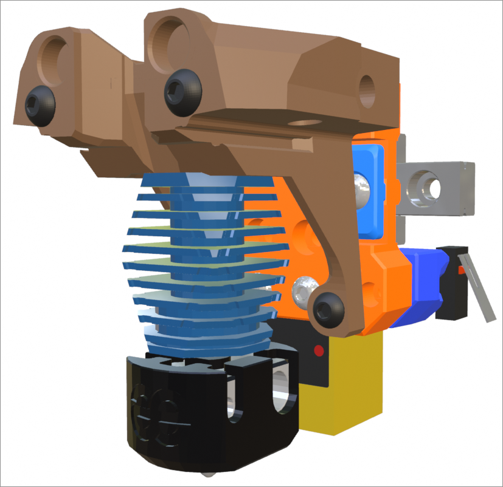
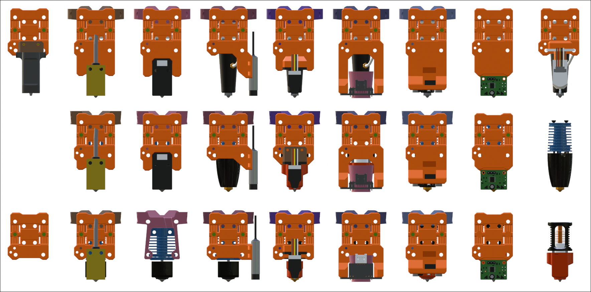

## MGN9C Front Mounted Rigid X-Carriages

This is a set of x-carriages for the Mini Stealth designed to fit on a front facing MGN9C linear rail. They mate with the new rigid core pieces that are available in their respective extruder folders. These x-carriages raise the toolhead by around 8mm causing some of the probes to not fit below the 2020 X extrusion. The image below shows which probes fit with the Goliath hotend, the UHF hotends and all standard hotends.

The belt management geometry is borrowed from the [Boop beta 4](https://github.com/PrintersForAnts/Boop) carriage by PrintersForAnts and uses two of their belt clamps secured with M3x6 BHCS and M3 hex nuts. 

A couple of the probes require an additional probe mount piece (shown in brown above). These are secured with a pair of M2x10 self tapping screws.
