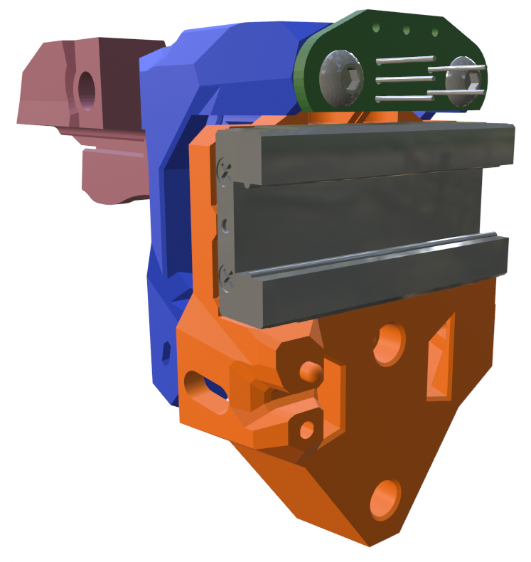

## PrintersForAnts - X Carriage Options

These Boop_front pieces (shown in blue below) replace the *front* and *upper* pieces from the P4A beta4 design. You will still need the *boop_center* piece (orange) and *belt_clamps* from the official [beta4 GitHub](https://github.com/PrintersForAnts/Boop/tree/main/beta_4/STL) page.

The mgn9c_toolhead_carriage pieces here are slightly remixed from the [Micron MiniAB](https://github.com/PrintersForAnts/Micron/blob/main/STLs/Gantry/Toolhead/MiniAB/mgn9c_toolhead_carriage.stl) carriage in order to make clearance for the different extruders supported by the Mini Stealth v2. To mount a Beacon probe you will need the *carriage_Beacon3D* as well as my custom *probe_mount_beacon*.

All of these x-carriage options should fit any extruder supported by the Mini Stealth.
