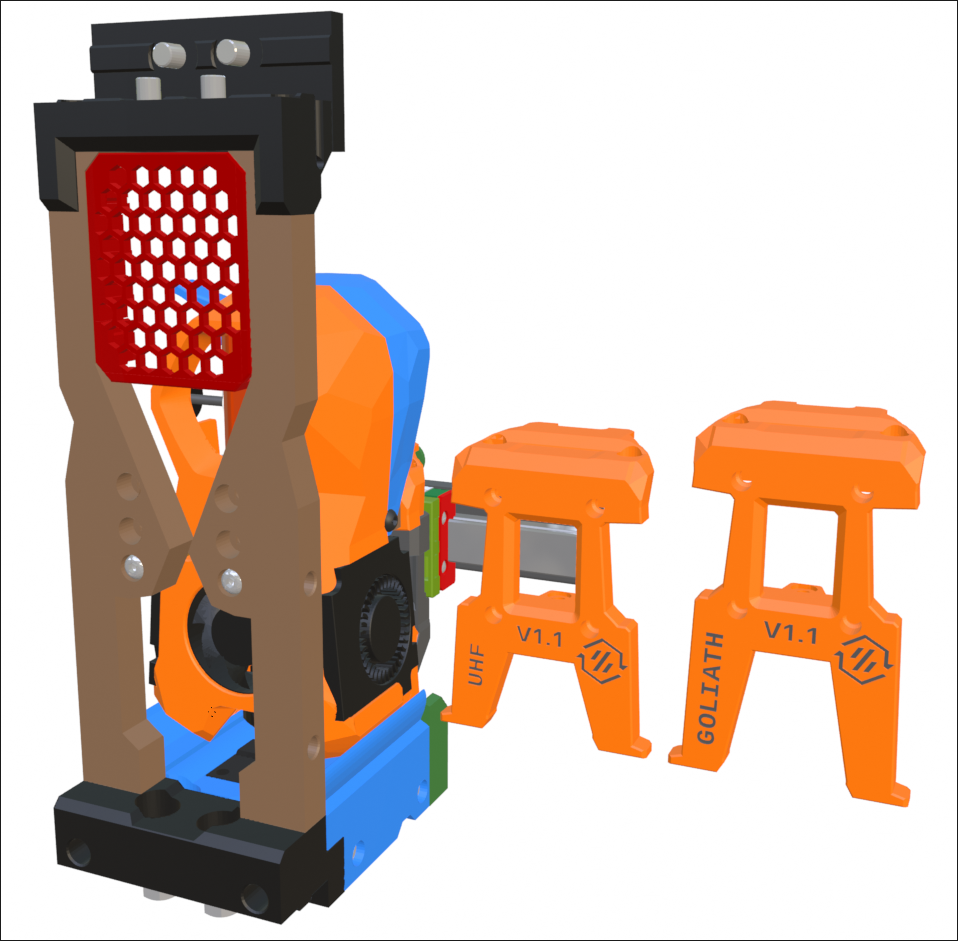
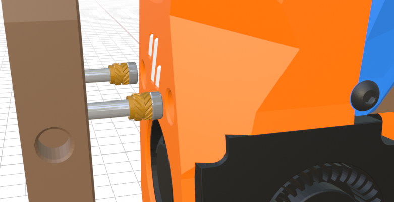

## StealthChanger - ModularDock

Here are the custom ModularDock parts fitted for the Mini Stealth toolhead. The adjustable screws in the left and right frame pieces overlap with the holes for the Dragon Burner so I have included Mini Stealth specific pieces. These have screw holes for standard, UHF and Goliath setups.

Adding magnets on the toolhead may not be the most secure solution due to the removable nature of the shroud. I have worked up a design where two magnets would be super-glued to a pair of M3x4x5mm heat-set inserts that can be screwed onto the adjustment screws on the left and right frame pieces.

I have also added a Mini Stealth specific *Cup_Body* that centers the silicone ooze blocker under the nozzle.

Please leave feedback, positive or negative, here as an issue or over on [TeamFDM.com](https://www.teamfdm.com/forums/topic/3433-mini-stealth-v2-is-available/).
