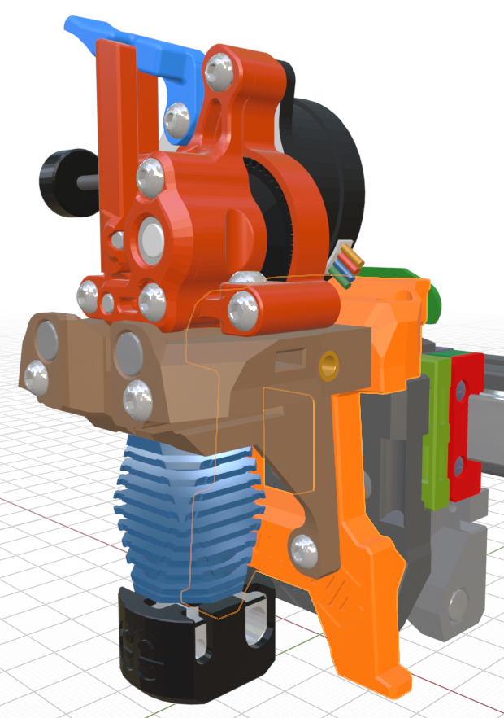

## StealthChanger Backplate

This is my first take at designing a StealthChanger backplate for mounting the Mini Stealth toolhead. I started with the Dragon Burner backplate and took a few creative liberties with the geometry. This design works in conjuction with my new, more rigid, core pieces so that no extra spacer piece is needed.

This setup should fit the following extruders although some of them are quite tight:

- Sherpa Mini

- Sherpa Micro

- Galileo 2 SA

- WristWatch BMG

- WristWatch G2

- Vz Hextrudort CNC

- LGX Lite

- Hummingbird

- Creality K1

It uses a pair of M3x45 BHCS and a pair of M3x10 BHCS to mount the core to the backplate.

This design should fit any of the hotends supported by the Mini Stealth including the UHF variants as well as the Goliath.

There is also a .blend file that is a complete assembly of the ModularDock, shuttle, backplate and toolhead. This is meant for reference and its geometry may not be up to date with the .stl files.

I will try to modify some of my motor-bridge pieces to see if I can get the umbilical PCB mounts to fit better for the extruders that have very low seating stepper motors.

Please leave feedback, positive or negative, here as an issue or over on [TeamFDM.com](https://www.teamfdm.com/forums/topic/3433-mini-stealth-v2-is-available/).
