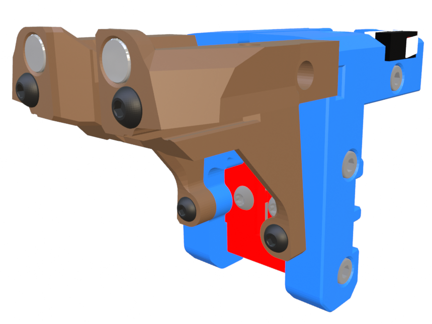

## Tiny-M x-carriage - Mini Stealth

This x-carriage fits the newer rigid core pieces and uses a pair of M3x45 and a pair of M3x10 BHCS to mount the core onto the x-carriage. Due to space constraints, the top two screws use square nuts inserted from the sides and the lower two screws use heat-set inserts installed from behind.
