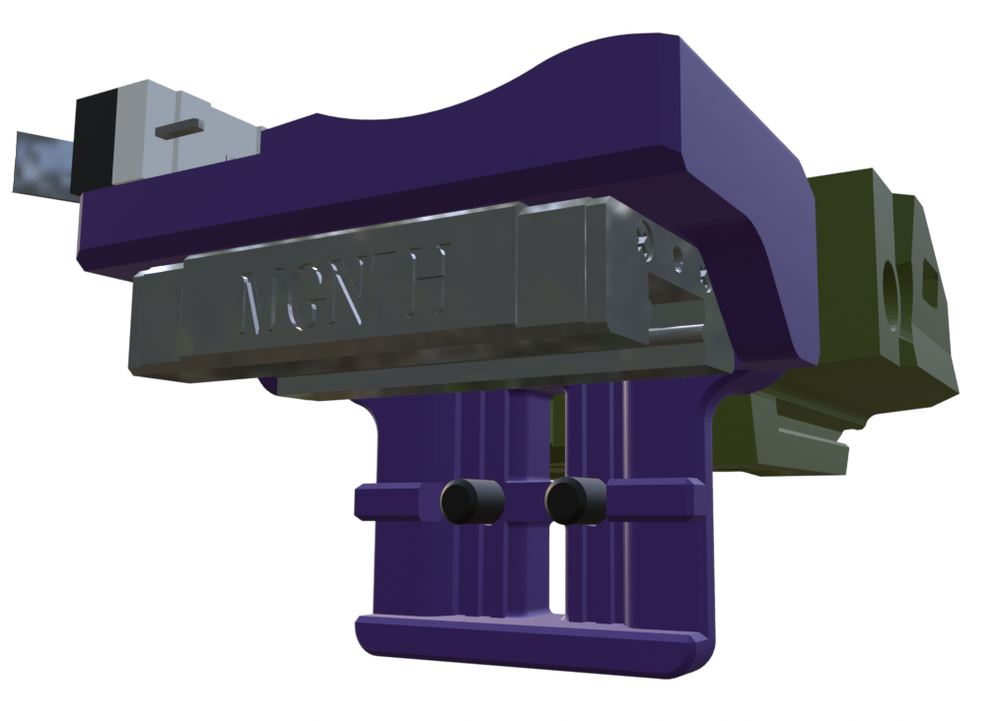

## X-Carriages for V0.1 & V0.2

These x-carriages have been made wider to allow for a stiffening rib to wrap around the MGN7 or MGN9 linear carriage. This makes the connection between the gantry and the toolhead much more ridgid but requires modified XY-joint-upper pieces to maintain X axis travel.
