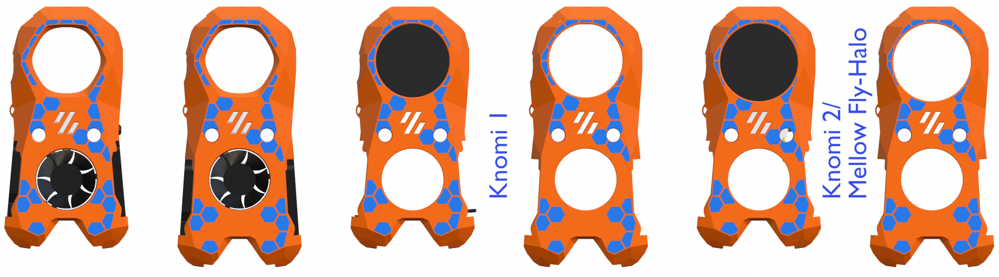

## Hex Patterns Based on Design by [3DP-MAMSIH](https://www.printables.com/model/225153-voron-stealthburner-face)
Here are six different versions of the hex-pattern inlay for the Mini Stealth.

I wrote a [tutorial](https://www.teamfdm.com/files/tutorials/2-adding-decorative-inlay-negative-body/) on how to apply this pattern within Prusa Slicer. It is also possible to apply the pattern as a multi-color print in Bambu Studio by following the process explained in [this video](https://www.youtube.com/watch?v=UekEbg_ZkgI).
