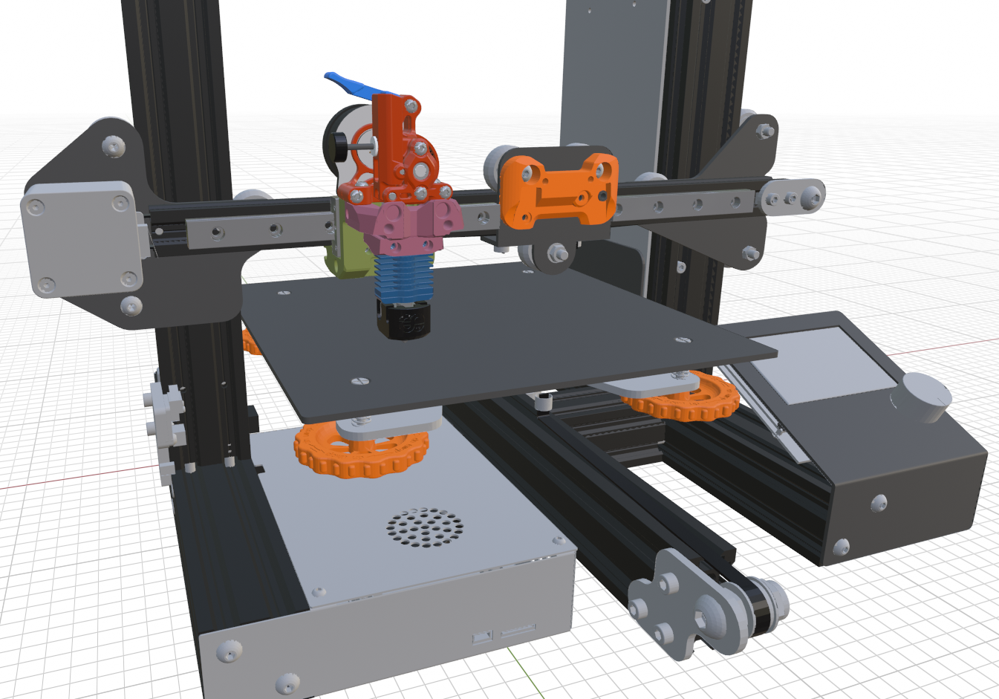
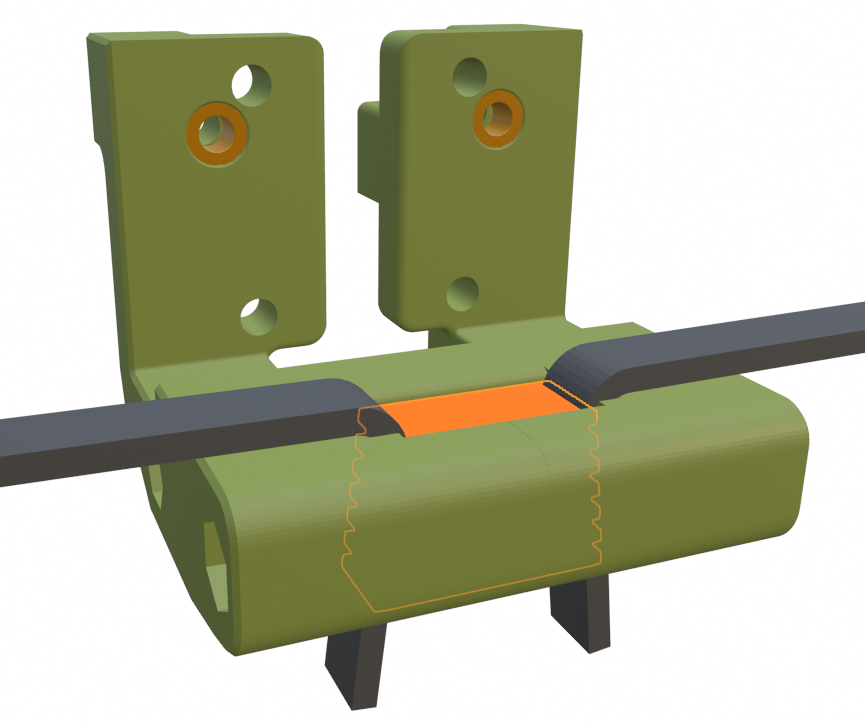
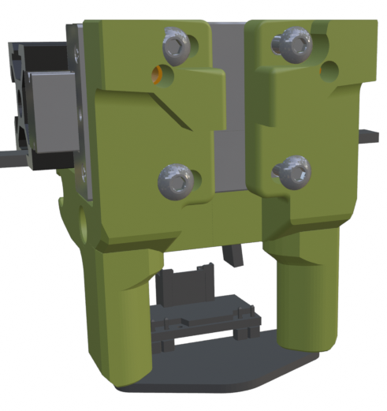
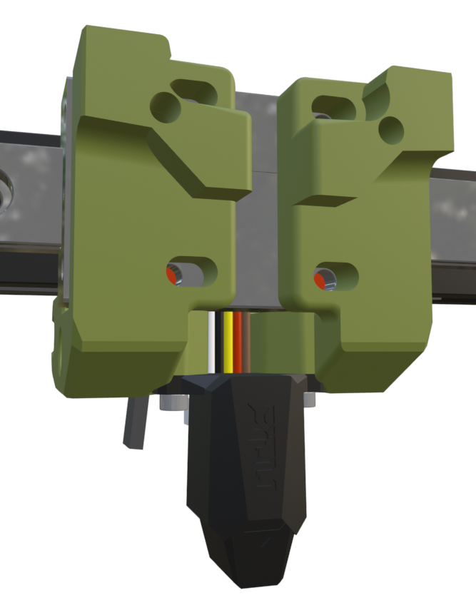
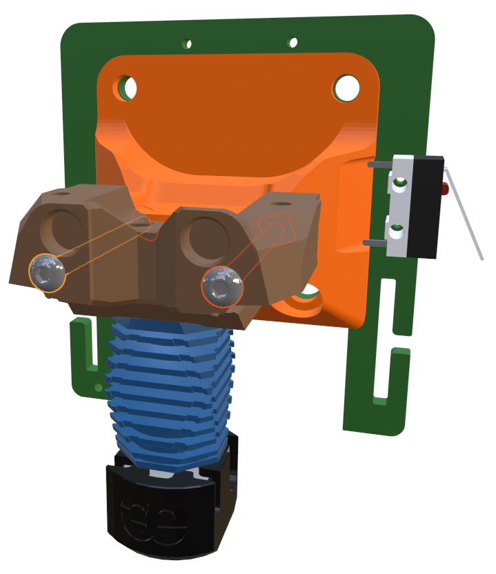

## Ender 3 Installation Options

Here are center mounts for installing the Mini Stealth (UHF or Standard) on an Ender 3. 

For some extruder options, the stepper motor sits rather low and might require some modification of the V-wheel plate.

I have also made side mounts for several probes that can be installed on the Differential IR shroud versions. They require M2.5x6 flathead screws to connect the brackets to the shroud while leaving clearance for the 4010 blower.

There are additional Switchwire style mounts for front or top mounted linear rails. The front mounted MGN12 rail can be installed directly on the 2020 extrusion. The rest of the linear rail mod variations are designed assuming 4.5mm of spacing between the 2020 extrusion and the back of the linear rail. The timing belt is secured from below with a toothed wedge. Further information is available in the TeamFDM comments starting [here](https://www.teamfdm.com/files/file/657-mini-stealth-mini-sherpa/?do=findComment&comment=1920&_rid=1756) but the GitHub files are more current.

With the front-mounted linear rails, there is room to install a Beacon3D probe or a Biqu MicroProbe under the x-carriage.

## Ender 6 Installation

The Ender 6 mount has been improved and should fit most of the extruder options except the Orbiter 1.5 and Galileo SA.

## Side-Mount Probe Offsets

|          | BL-Touch | CR-Touch | PINDA | Diff IR | MicroProbe | BTT Eddy |
| -------- | -------- | -------- | ----- | ------- | ---------- | -------- |
| X Offset | 37.5 mm  | 40 mm    | 37 mm | 32 mm   | 38 mm      | 42 mm    |
| Y Offset | -6 mm    | -6 mm    | -6 mm | -4 mm   | -6 mm      | -6 mm    |

