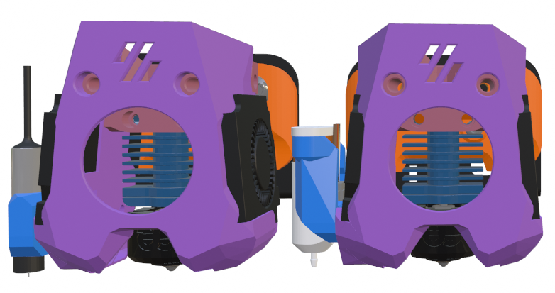
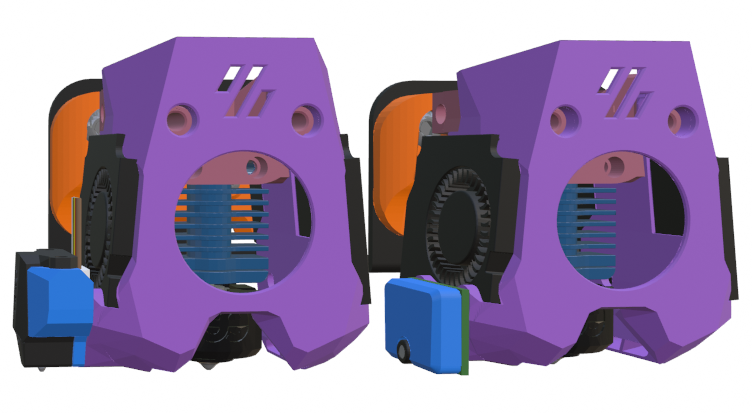

## Ender Installation Options

Here is a center mount for installing the Mini Stealth on an Ender 3 as well as mounts for an Ender 6 with or without a BL-Touch. I have also made side mounts for several probes that can be installed on the Differential IR shroud versions. They require M2.5x6 flathead screws to connect the brackets to the shroud while leaving clearance for the 4010 blower.

