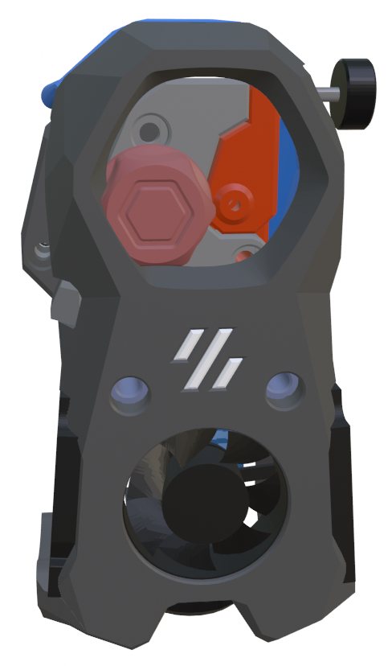

## Mini Stealth - [Galileo SA](https://github.com/JaredC01/Galileo2/tree/main/galileo2_standalone)

This version of the Mini Stealth is modified from the Orbiter 2.0 version.

The Galileo Standalone extruder requires a modified idler arm to fit cleanly inside of the Mini Stealth unless using a Crop-Top version. Their filament advance thumb screw will also collide with a non Crop-Top Mini Stealth.

For more information, questions and feedback, I am most active at [TeamFDM.com](https://www.teamfdm.com/files/file/612-mini-stealth-orbiter-20/?tab=comments) but the files here are the most current.
