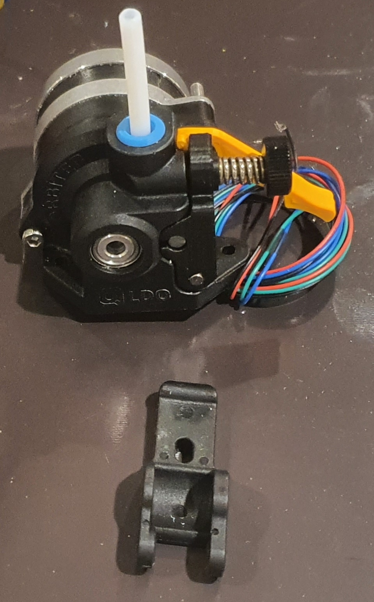

## Mini Stealth - Orbiter 2.0 w/ Filament Sensor

The Orbiter 2.0 filament sensor pushes the motor_bridge back by 3.6mm and requires different cutouts to the shroud and the cable_door. The .stl files under this folder address these changes.

I have developed an optional filament release lever for the Orbiter 2.0 which fits over the M3x20 SHCS securing the stepper motor and uses it as the pivot point. It is designed around a smooth socket head cap screw that should have an outer diameter of 5.4mm. The stock idler arm is too tall to fit inside of the Mini Stealth unless using a Crop-Top version. 

To install the release lever, you must remove the idler arm and the stepper motor screw. Then place the release lever in position and thread the stepper screw through the hole in the release lever.

For more information, questions and feedback, I am most active at [TeamFDM.com](https://www.teamfdm.com/files/file/612-mini-stealth-orbiter-20/?tab=comments) but the files here are the most current.
