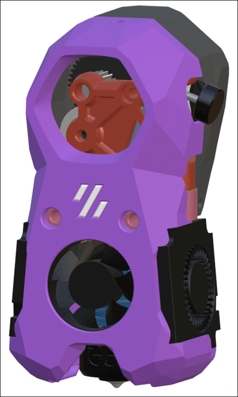

## ProtoXtruder

When installing a [ProtoXtruder](https://www.printables.com/model/436425-protoxtruder) in a Mini Stealth toolhead, the stepper motor sits too low and interferes with the x-carriage of most printers. I have made modified Front and Back pieces of the extruder that should allow it to be installed on any of the printers supported by the Mini Stealth. There are also seperate 1mm lift spacers for each version of the ProtoXtruder but using a spacer may not be as ridgid as the modified parts. 

The [ProtoXtruder 2.0](https://www.printables.com/model/822947-protoxtruder-20) uses the same mounting pattern and fits onto the same core pieces. It is released under a less permissive license so I haven't made modified parts for it but with the spacer it should fit just as well as the original ProtoXtruder.
