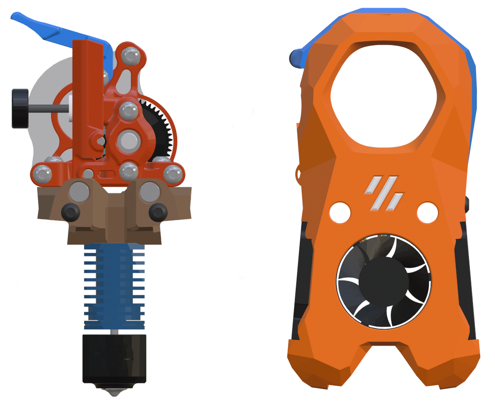

## Mini Stealth - Sherpa Micro Mirrored

This version of the Mini Stealth is based on a mirrored [Sherpa Micro](https://github.com/Annex-Engineering/Sherpa_Micro-Extruder) extruder putting the tensioner screw on the left side of the toolhead. I have made a filament release lever for the Sherpa Micro that requires modified extruder parts which are in the Extruder_Modifications folder.

The extruder parts are licensed under the [Annex Engineering License](https://github.com/Annex-Engineering/ANNEX-Engineering-License-Agreement).

For more information, questions and feedback, I am most active at [TeamFDM.com](https://www.teamfdm.com/files/file/757-sherpa-micro-vz-ridga-cw2-module/?tab=comments) but the toolhead files here are the most current.
