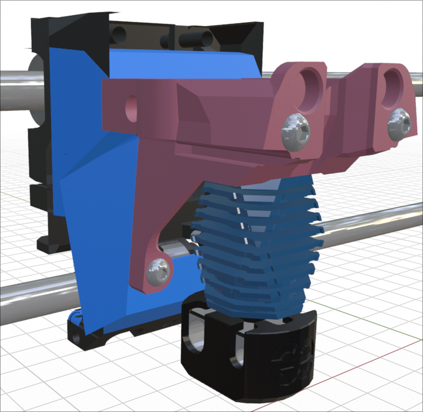

## Rigid Flat Mounting Core Pieces

This is a new style of core pieces that I am working on. For now, they are only available for the Sherpa Mini, ProtoXtruder and and HGX Lite extruders. 

The core has been stretched back by 6mm so that it clears the back of the 4010 blowers. It also adds two screw mounting locations 30mm below the top mounting screws. This should add a lot of rigidity to the toolhead but slightly complicates the installation. The thermistor and hotend heater wires need to be fed through from the bottom before mounting the core onto the x-carriage/backplate but the hotend may need to be screwed on after securing the bottom two screws of the core piece.

These new cores will not replace the standard cores but are meant to allow the Mini Stealth to be mounted more easily to more printer setups, such as the Prusa MK3 printers and the StealthChanger backplates.

I will be working on these options as well as new Trident/V2.4 x-carriages that can accept these new core pieces. These cores will not work well for V0 printers without loosing yet more travel in the Y axis. Expect these files to change as I develop more parts to fit with these cores.
