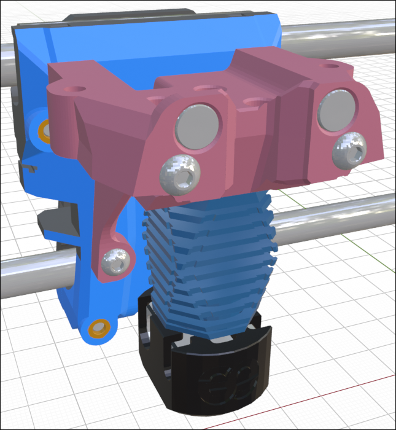

## Rigid Flat-Back Core Pieces

This is a new style of core pieces that I am working on. For now, they are only available for the Sherpa Mini, ProtoXtruder and and HGX Lite extruders. 

The core has been stretched back by 6mm so that it clears the back of the 4010 blowers. It also adds two screw mounting locations 30mm below the top mounting screws. This should add a lot of rigidity to the toolhead but slightly complicates the installation. Some hotends will need to be installed after the core piece has been mounted to the x-carriage. The thermistor and hotend heater wires then need to be fed through from the bottom of the core piece. The wire channel is designed to be large enough to allow a 2-pin JST connector to fit through it.

These new cores will not replace the standard cores but are meant to allow the Mini Stealth to be mounted more easily to other printer setups, such as the Prusa MK3 and the StealthChanger backplates.

I will be working more on these options as well as new Trident/V2.4 x-carriages that can accept these new core pieces. These cores will not work well for V0 printers without loosing yet more travel in the Y axis. These files might change slightly as I develop more parts to fit with these cores.
