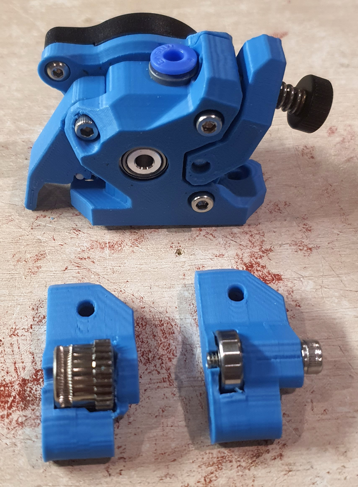
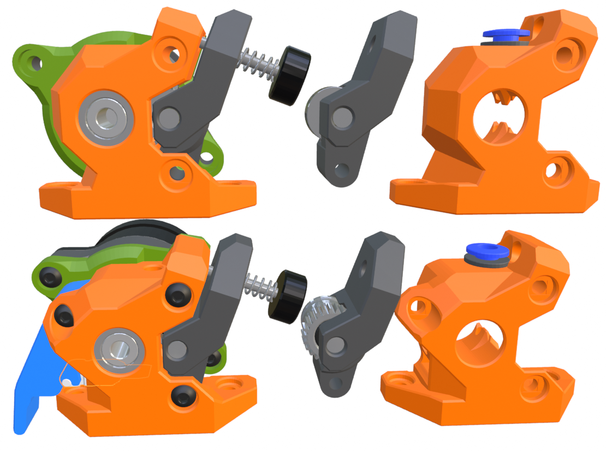

### WristWatch Orbiter 2.x

This extruder is a bit of a mashup of the WristWatch BMG and G2 extruders. It fits the Orbiter 2.0 or 2.5 internals. There is a second version of the idler arm that fits a 604ZZ bearing (4x12x4mm) to make the extruder function a little more like the Galileo 2 extruder.

The Orbiter 2.5 upgrade kit can be used to build this extruder but it does not include the 4x16mm shaft for the idler arm or the tensioner screw/spring combo. The shaft can be replaced with an M4x18 screw but the tensioning screw will have to be sourced seperately. 

### Side Mounted Filament Cutter

There is a also a filament cutter version of this extruder which fits a blade below the hobbed gears. It fits replacement Bambu blades and uses a spring from a clicker pen (5mm x 20mm) to keep the blade clear of the filament path until actuated.

The cutter arm does require organic supports for the small hook feature that helps grabbing the blade. It uses an M3x14 screw for the pivot of the cutter arm. The blade recess in the extruder body might need a little cleanup to ensure that the blade can slide smoothly.

There is an additional subtraction part that removes the necessary material from the Mini Stealth shroud to allow the cutter arm to fit. It has two locating cylinders to align the .stl with the shroud in the slicer. It is easiest to align the parts from the bottom view.

