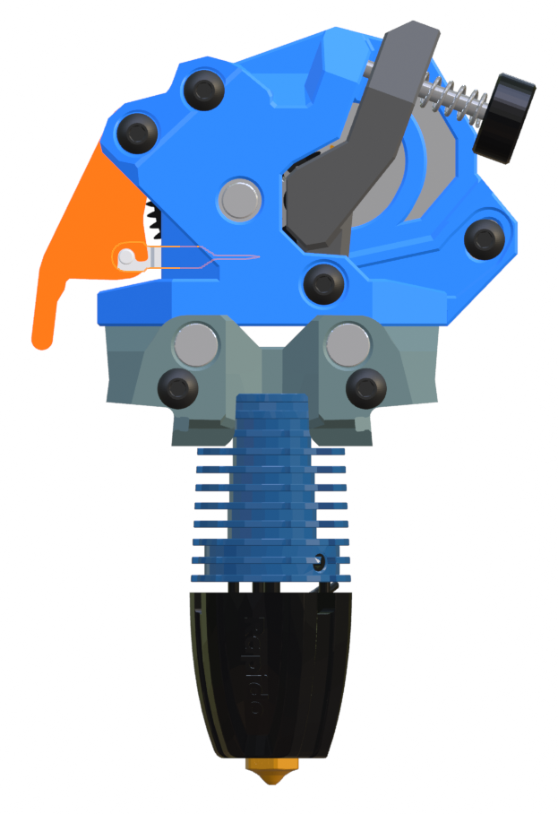
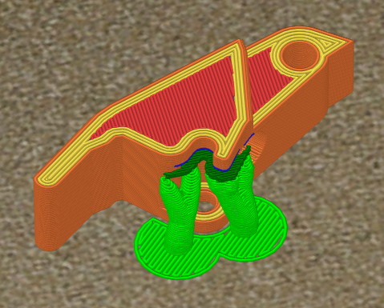
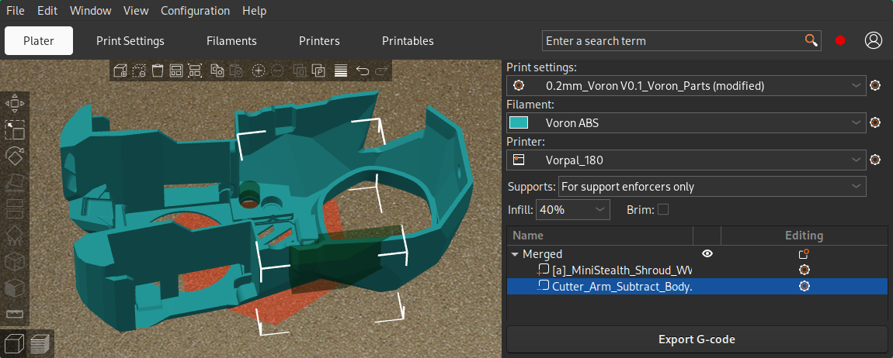

### Wrist Watch BMG with Side Mounted Filament Cutter

This is a remix of the [WW BMG](https://github.com/bythorsthunder/Voron_Mods/tree/main/Wristwatch_Extruder_BMG) extruder which adds a filament cutter below the hobbed gears. It fits replacement Bambu blades and uses a spring from a clicker pen (5mm x 20mm) to keep the blade clear of the filament path until actuated.

This remix doesn't change any of the functional geometry of the extruder. The cutter arm does require organic supports for the small hook feature that helps grabbing the blade. It uses up to an M3x20 screw for the pivot of the cutter arm. The blade recess in the extruder body might need a little cleanup to ensure that the blade can slide smoothly.

There is an additional subtraction part that removes the necessary material from the Mini Stealth shroud to allow the cutter arm to fit. It has two locating cylinders to align the .stl with the shroud in the slicer. It is easiest to align the parts from the bottom view.

