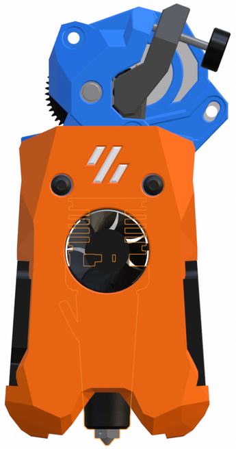
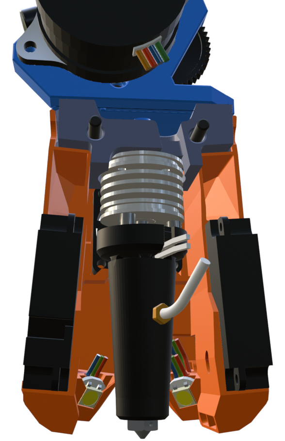

## Mini Stealth - Vz Goliath

This is a first take at making a shroud to fit the Goliath Air hotend. For now, there is only a crop-top shroud available which uses the standard 4010 blowers for part cooling and a 2510 radial fan for cooling the hotend heat-break.

 

The Goliath hotend fits onto any of the existing DragonAce core pieces in this repository so it should fit any of the extruders currently supported by the Mini Stealth. As installed, the nozzle sits 18.5mm lower than any of the standard length hotends and 10mm lower than the UHF hotends.

There are spring clips built into the shroud to hold the 2510 fan in place. They are designed with a 0.3mm gap that will not require supports but should allow them to act as springs. These might still need some adjustment.
