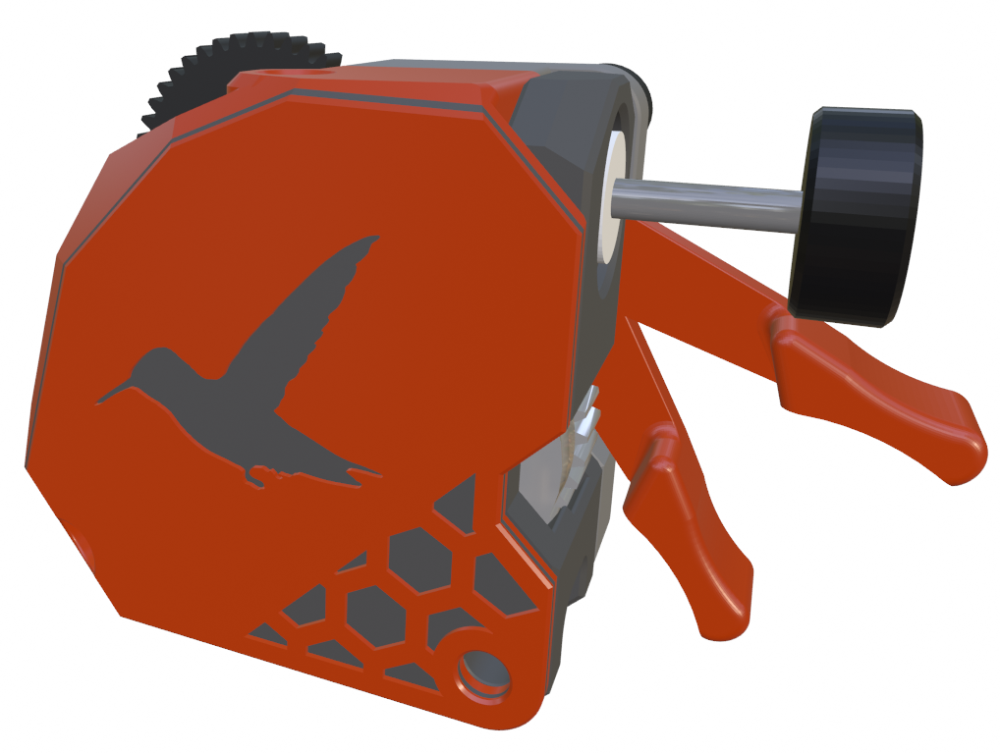

## Hummingbird - Mini Stealth version

I have added a filament release lever to the [Hummingbird](https://www.printables.com/model/367706-hummingbird-extruder) extruder to fit better with the Mini Stealth setup. This requires several modified extruder parts which can be found in the *Extruder_mods* folder. 

There is a blank front as well as the pictured logo+hex version. The back piece is the most changed in order to make space for the release lever. The front piece was only modified to match the new back piece. The *idler arm* has been slightly modified to fit better inside the top of the Mini Stealth shroud.

The filament release lever is installed with an M3x10 grub screw before installing the front of the extruder. The rest of the extruder is assembled in the same manner as a stock Hummingbird extruder.

For more information, questions and feedback, I am most active at [TeamFDM.com](https://www.teamfdm.com/files/file/616-mini-stealth-lgx-lite/?tab=comments) but the files here are the most current.
