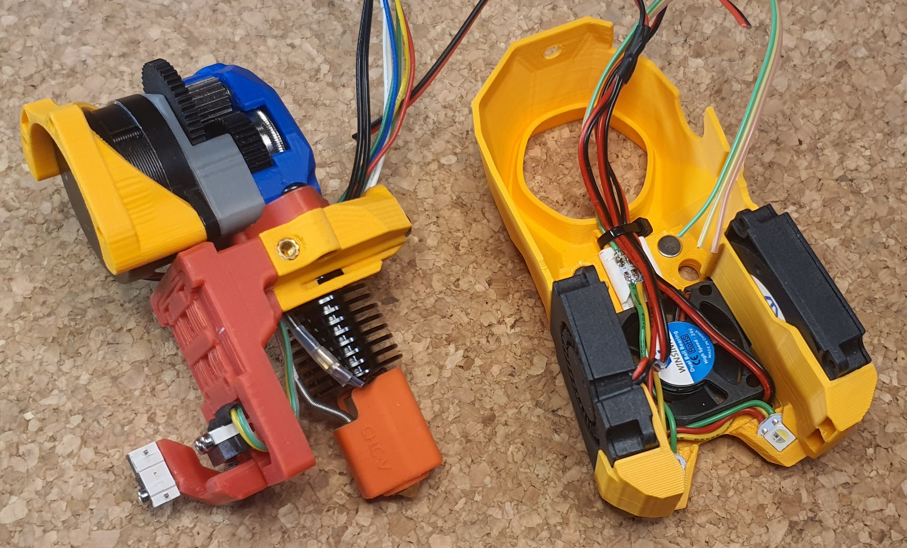

## Mini Stealth DAB

This is a flexure based nozzle probing option for mounting the Mini Stealth toolhead in a Voron Trident or V2.4. It uses a simple linear compliant mechanism to provide ~0.5mm of Z travel while being quite rigid in the other axes. It weighs a mere 18g fully assembled with Z and X endstops.

This is still in Beta as I haven't had much time to do testing yet. Further information and community feedback can be found on [TeamFDM.com](https://www.teamfdm.com/files/file/760-mini-stealth-dab-beta-release/).
