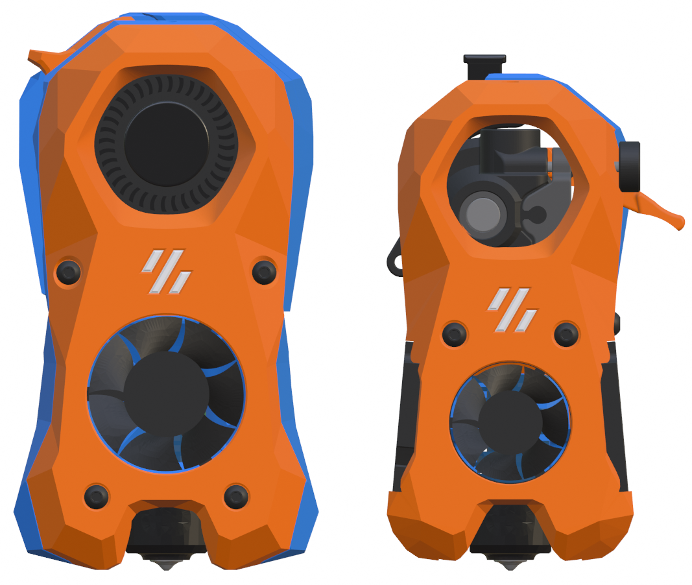
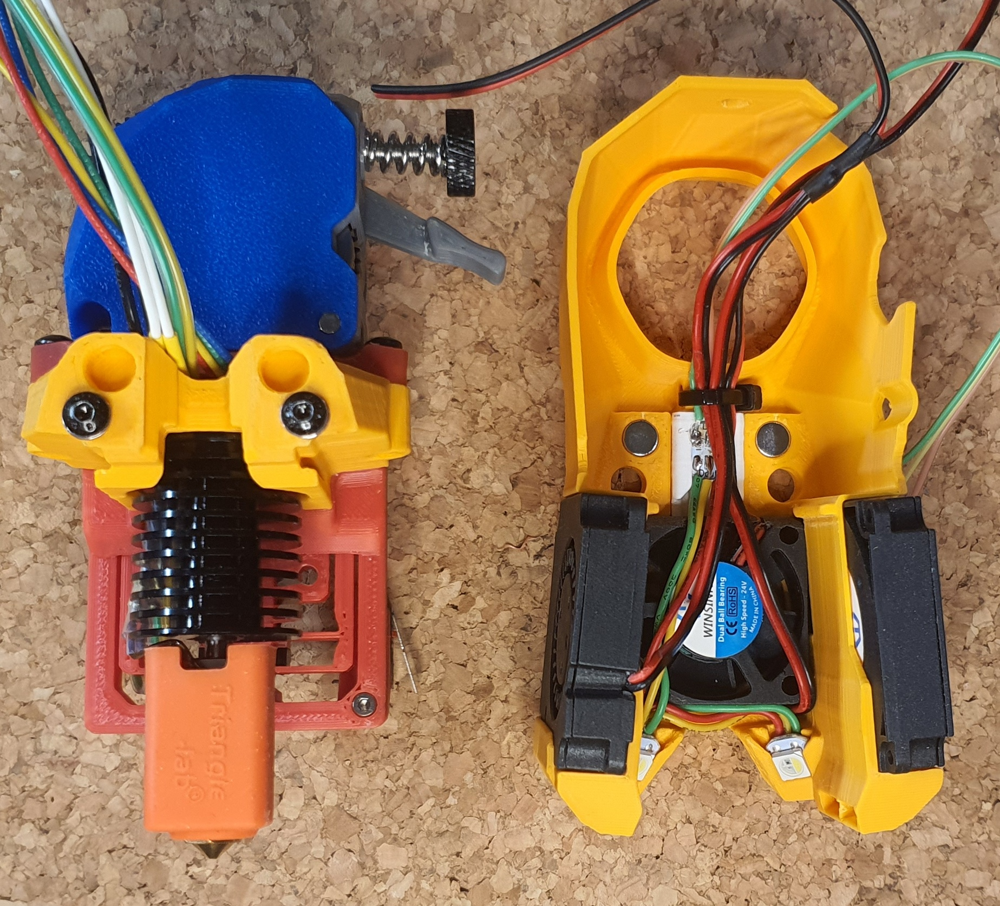
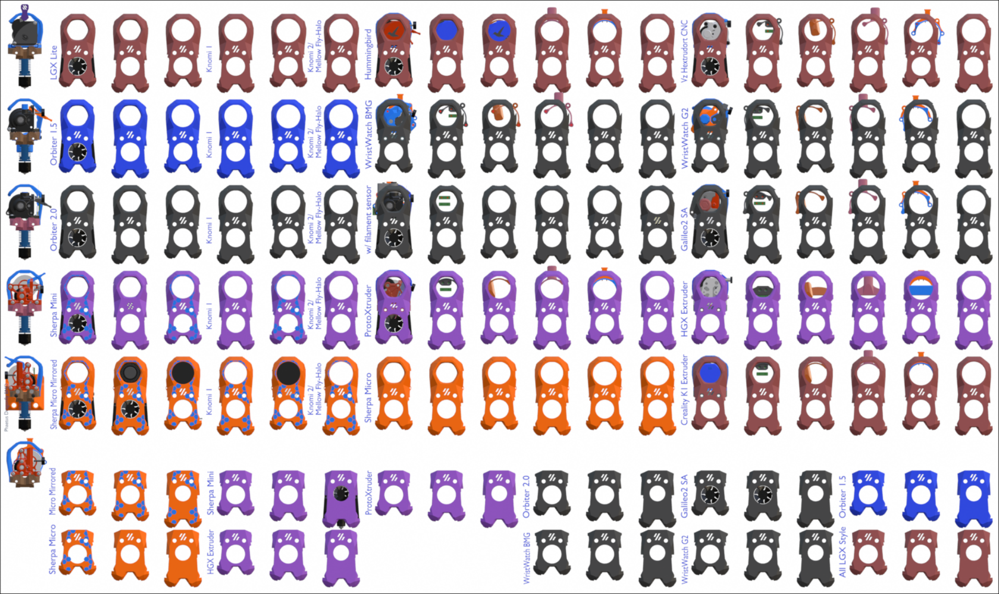
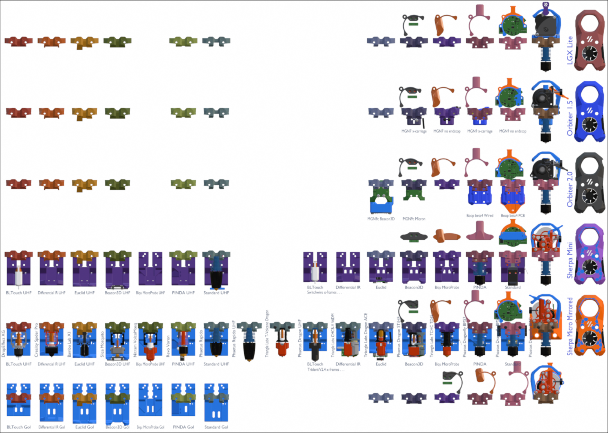
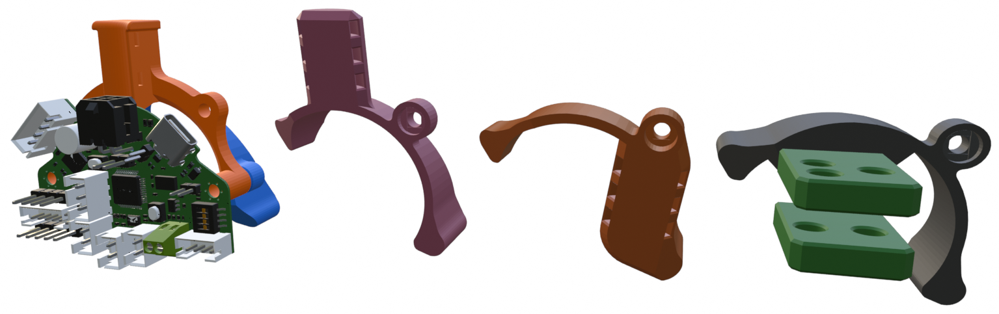
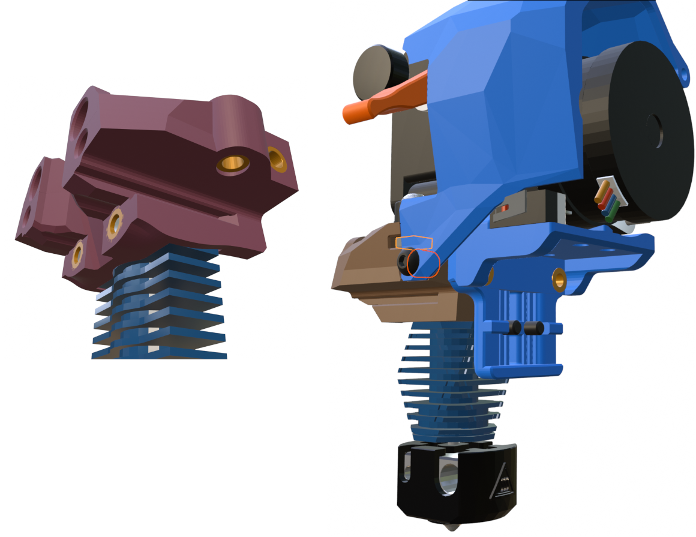
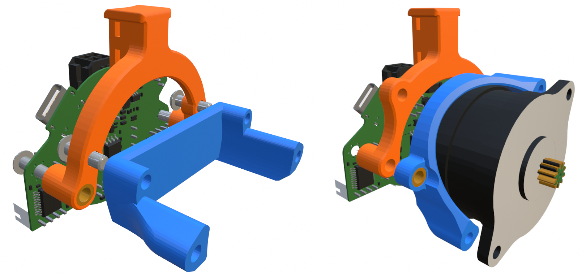
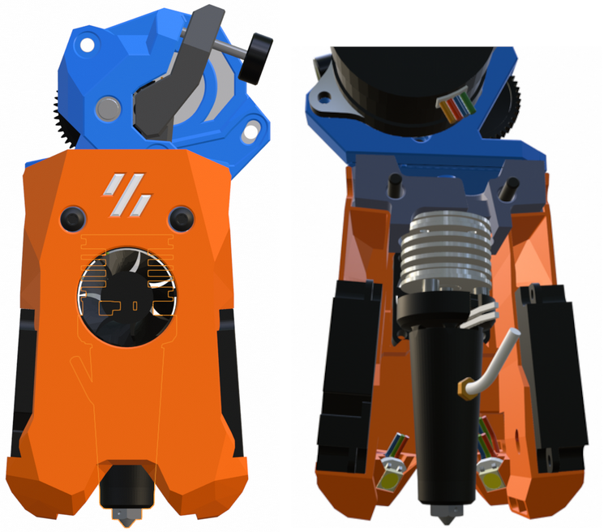

## Mini Stealth - A Scaled Down Stealthburner

This is the Version 2 release of the Mini Stealth toolhead. It is about 5/8 the size of the official Stealthburner and weighs considerably less. It uses a pair of 4010 blowers for part cooling and a 3010/2510 fan for the hotend. The blowers use glued in [air guides](https://www.teamfdm.com/forums/topic/1886-vorpal-180-a-printed-printer/?do=findComment&comment=13431&_rid=1756) to increase airflow by [about 20%](https://www.teamfdm.com/forums/topic/1886-vorpal-180-a-printed-printer/?do=findComment&comment=13566&_rid=1756) compared to the Mini Stealth v1. This toolhead was entirely designed in Blender and I only have mesh files available.

The new design mounts the extruder and hotend to a *[core piece](https://www.teamfdm.com/forums/topic/1886-vorpal-180-a-printed-printer/?do=findComment&comment=15428&_rid=1756)* and mounts the blowers, hotend fan and LEDs into the *shroud* that slides onto the core. This makes assembly and maintenance much easier and the extruder can be fully removed while the core remains installed on the printer. There are thirteen extruders supported by the Mini Stealth.

| Orbiter 1.5    | Orbiter 2.0                         | Sherpa Mini   | LGX Lite | VzHextrudort |
| -------------- | ----------------------------------- | ------------- | -------- | ------------ |
| WristWatch BMG | WristWatch G2SA                     | Sherpa Micro¹ | HGX Lite | Galileo SA   |
| Hummingbird    | ProtoXtruder <small>(v1&v2)</small> | Creality K1   |          |              |

¹ <small>There is also a mirrored version of the Sherpa Micro that adds a filament release lever on the left side</small>

There are currently 22 different hotends supported by this toolhead. The cores for the top three in the chart are shared by the others in each group. The bottom nine² hotends each have their own cores.

| Slice Mosquito          | Phaetus Rapido                | Phaetus Dragon ST/HF |
|:-----------------------:|:-----------------------------:|:--------------------:|
| Mellow NF Crazy Volcano | Phaetus Rapido UHF            | DropEffect neXtG     |
| Nitram VolcoMosq        | Phaetus Dragon UHF            | Triangle Labs TZ V6  |
|                         | Triangle Labs T-Vocano Dragon |                      |
|                         | Triangle Labs CHCB-V V6DM     |                      |
|                         | DropEffect neXtG UHF          |                      |
|                         |                               |                      |
| Phaetus Dragonfly BMO   | Revo Voron                    | Bambu Lab X1         |
| Phaetus Dragonfly BMS7  | T-Labs Dragon ACE + Goliath   | Creality Spider Pro  |
| Phaetus Dragonfly BMS6  | Triangle Labs TCHC TD6S       | Dropeffect XG        |

² <small>The Goliath hotend is compatibile with the DragonACE core.</small>

Here is an example of how the core and shroud are assembled. There are pockets for 3x6mm magnets. If the magnets aren't seated completly flush, they can prevent the shroud from seating in the correct location.

Looking closely you can see three M3 shim washers (DIN988) stacked under each of the M3x40 BHC screws securing the core to the [DAB x-carriage](https://www.teamfdm.com/files/file/760-mini-stealth-dab-beta-release/). Some component combinations will require these shims, such as with the MGN9 mod on a V0.1/2 in order to avoid crushing the linear carriage when installing. It is best practice to do a dry-run and measure clearances before final installation.

The .stl files in the Common_Parts folder should be compatible across the entire range of Mini Stealth versions. This includes all of the x-carriage options (DAB as well) and supplemental parts such as LED mounts and diffuser.

There are 90 different shrouds grouped by extruder type. Each of the 90 shrouds comes in four flavors. The basic shroud, a ZeroClick version and left or right probe-mount versions. The last two use M2.5x6 flathead screws to fit brackets that hold [six different probes](https://raw.githubusercontent.com/atrushing/Mini_Stealth/main/Ender_3_parts/Ender_3_Probe_Options_1.png). There are also versions of all of these shrouds designed to fit a 2510 hotend fan. The Goliath shrouds are only available as CropTop with a 2510 fan. 

There are six sets of core pieces with unique mounting holes for different extruder groups. Each extruder folder has a copy of the applicable core pieces to avoid confusion. The extruders with magenta shrouds above all use an adapter plate to secure the extruder to the core piece. 

There are four different motor bridge pieces for each extruder that address different cable management options. The umbilical PCB option uses a pair of heat-set inserts to secure a secondary printed piece.

### Heatset Inserts

- The only hotends that require heat-set inserts are the Bambu and the Dragonfly BMS models.

- Most of the extruders are secured with two inserts from below the *core* piece but some use M3 square nuts installed from the side of the *core*

- Most of the x-carriages will use a pair of inserts from the back to secure the *core*

- Most of the cable_doors will use one insert on the non-hinged side to secure it to the back side of the *core*

- A few cable_doors use two inserts on either side at the bottom and then hook under the top of the shroud

- The Omron probe (and Klicky) requires a pair of inserts in the retainer_bracket behind the x-frames

- Mounting a Beacon/Cartographer probe uses two inserts in the bottom of the x-frames

- The motor_bridge mounts for 2 or 3 hole cable chains will require inserts

- Mounting an umbilical PCB requires two inserts. Depending on which 
  extruder is used, the second image below shows where they are installed

### Mini Stealth - Vz Goliath Hotend Versions

This is an effort at making a shroud to fit the Goliath Air hotend. There are only crop-top shrouds available which use 4010 blowers for part cooling and a 2510 radial fan for cooling the hotend heat-break.

The Goliath hotend fits onto any of the existing DragonAce core pieces in this repository. As installed, the nozzle sits 18.5mm lower than any of the standard length hotends and 10mm lower than the UHF hotends.

There are spring clips built into the shroud to hold the 2510 fan in place. They are designed with a 0.3mm gap that will not require supports but should allow them to act as springs. These might still need some adjustment.

### Addendum

I still need to work up new assembly instructions for this v2 toolhead. For supporting these designs, I am most active over on [TeamFDM.com](https://www.teamfdm.com/profile/1756-atrushing/content/?type=downloads_file&change_section=1) and will be happy to [answer questions](https://www.teamfdm.com/forums/topic/3433-mini-stealth-v2-is-available) there. The Mini Stealth files available on TeamFDM are of the version 1 release, while the current v2 files are all here.

I started working on a [configurator](https://atrushing.github.io/Sidewinder-Switchwire/) for this toolhead but I still have a lot to learn about JavaScript. If anyone would like to help with this, please drop me a message on [TeamFDM](https://www.teamfdm.com/profile/1756-atrushing/).

If you would like to [support](https://paypal.me/atrushing) the development of these mods I would be very grateful.

### - - Changelog - -

#### 6 Feb 2025

- Added support for WristWatch BMG & G2SA extruders

- There are now two versions for the Sherpa Micro, normal and mirrored. (the mirrored version fits my modification with a filament release lever on the left side)

- Added the modded+mirrored Sherpa Micro .stl files in this repo

- Added support for HGX Lite extruder

- Added support for Creality K1 extruder

- Added support for Goliath hotend (CropTop only)

- Added 2.4/Trident x-frames for Goliath hotend

- Minor shroud geometry cleanup

- Fixed mis-aligned first layer of x-frame pieces

- Added support for 2510 hotend fan to all shroud options

- Added right side probe support

- Added new hex patterns to fit the 2510 shrouds

- Re-organized GitHub folder structure based on extruder selection

- Update and improve readme files

#### 6 Apr 2024 v2.0 Release

- More extruders have been added.

- More hotends have been added.

- The shroud is now separate from the core.

- The shroud fits onto the core with a pair of sliding grooves and can fit magnets to

- improve the connection as needed.

- The hotend can be installed to the core and then mounted to the printers' gantry.

- Everything else can be installed (or removed) while on the printer.

- All core pieces and shrouds are compatible with 25mm or 26mm x-carriages. :: i.e.

- Mini Stealthburner CNC aluminum carriages.

- All x-carriages are compatible with any hotend/extruder combination.

- There are specific UHF x-frames for Trident, V2.4 and Switchwire printers to provide probe compatibility.

- The V0.1/V0.2 x-carriages are much stiffer with side ribs that require included XY_Joint_Upper pieces.

- The 25mm spacing improves the Ender 3 mount which is available in the repo.

- The LED diffuser and carriage are new and simplified.

- The Rainbow BARF carriage is now in two part and should be easier to fit.

- All shrouds have standard, ZeroClick and Differential IR options.

- The 4010 blowers use a glued in (CA glue) air guide to increase airflow at the nozzle.

- The UHF shrouds have been re-worked to put the 4010 blowers lower, matching the standard shrouds.

- New probe mounting side brackets have been added that fit the Differential IR shrouds. Thanks to @Titus A Duxass for the concept!
  
  - Biqu MicroProbe
  
  - PINDA
  
  - BL-Touch

- I have added Knomi2 shrouds that should also fit the Mellow Fly-Halo display.

- I have made Crop-Top shrouds for each extruder option.

- Each extruder has motor_bridge pieces that support cable management, cable chain mounts or umbilical PCB mounting.

- The umbilical PCB mounts are vertical for better ADXL readings.

- All parts have been modified for cleaner and more consistent geometry across versions.

#### 16 May 2023 v1.2.5

- Added Euclid and Biqu MicroProbe mounts for Trident, 2.4 and Switchwire

- Upload corrected version of ZeroClick Mount

#### 12 Apr 2023 v1.2.5

- Added missing Crop-Top .stl and image

#### 4 Mar 2023 v1.2.5

- Added feature to x-frame_right to allow mounting X limit switch as with the Umbilical Mod

- Added Beacon3D compatible x-frame sets for V2.4, Trident and for Switchwire

- Added new shrouds to fit the Creality Spider Pro hotend

#### 28 Feb 2023 v1.2.4

- Added wire slot for LEDs wires to fit past 3010 fan. The last revision wasn't sufficient.

- All shroud files are new.

#### 26 Feb 2023 v1.2.3

- Fixed pinching of LED wires when using 3010 fan.

#### 24 Feb 2023 v1.2.2

- Improved rigidity of x-carriage mounting for the V0.1/V0.2 by moving the heat-set insert to the back side.

- This requires 5mm longer screws to mount the shroud.

- Improved how the front two screws fit into the shroud when mounting onto the carriage. This used to be chamfered but now is flat for better load transfer. All shroud .stl files are new.

- Uploaded new version of x-frame pieces with more clearance to fit 4010 blowers from different suppliers.

- Added x-frame pieces for Switchwire builds. These pieces can fit the standard capacitive probe or fit a BL-Touch. Since the stepper sits very low with the Orbiter, the Z height of the nozzle is raised by 3mm compared to the official Switchwire x-frame design.

#### 22 Feb 2023 v1.2.1

- Added a hex pattern and tutorial based on the 3DP-MAMSIH mod

#### 13 Feb 2023 v1.2.0

- Improved cooling by aiming ducts 6 deg lower at hotend nozzle tip.

- Added compatibility with 3010 hotend fan. 3007 fan still fits using clip-in adapter

- Added versions for ZeroClick mod

- Added versions for differential IR probe.

- Added newer version for the VolcoMosq hotend

- Minor geometry cleanup.

- All shroud .stl files are new

#### 10 Feb 2023

- Release of Sherpa Mini version

#### 31 Jan 2023 v1.1.7

- Added stretched versions for the Rapido UHF, Dragon UHF and the VolcoMosq hotends

#### 19 Jan 2023 v1.1.6

- Added Umbilical-mod mount remixed from skuep's mod

- Replaced motor_bridge with version with space for M3 heat set inserts to allow for mounting PCB or Umbilical-mod behind the stepper

#### 22 Nov 2022 v1.1.5

- Added versions for Slice Mosquito hotend

#### 10 Nov 2022 v1.1.4

- Added an x_carriage for the V0.1 MGN-9 mod

#### 1 Nov 2022

- Release of LGX Lite version

#### 24 Oct 2022 v1.1.3

- Added versions to fit the Rapido HF hotend

#### 22 Oct 2022 v1.1.2

- Added versions to fit the Revo Voron hotend

#### 22 Oct 2022 v1.1.1

- Fixed mesh error in [a]_MIni_Stlb_Orbiter_2.0_main_body.stl

#### 17 Oct 2022 v1.1.0

- Fixed wire clearance issue on x_carriage_mini_stlb

- Updated all main_body files with with more room for cable routing

#### 15 Oct 2022 v1.0.1

- Added versions for compatibility with the Dragon hotend

- Changed naming scheme for better description of versions

#### 14 Oct 2022 v1.0.0

- Modified 'cable_door' due to interference with V0.1 x-axis endstop.

#### 13 Oct 2022

- Release of Orbiter 2.0 version

#### 30 Sept 2022

- Initial Mini Stealth release (Orbiter 1.5 version)
